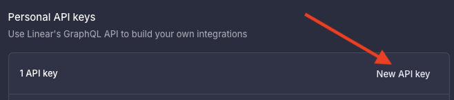
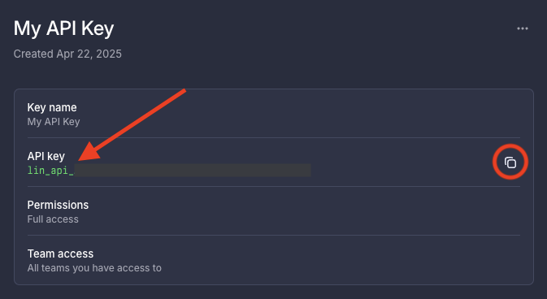

# Linear MCP Server

This project provides an MCP server for interacting with the Linear API, enabling integration with MCP clients like Cline, IDE extensions, and other AI tools. It provides tools for managing Linear issues, projects, and teams via the Model Context Protocol.

This package is available on npm: [@touchlab/linear-mcp-integration](https://www.npmjs.com/package/@touchlab/linear-mcp-integration)

**Current Status:**
*   Personal Access Token (PAT) authentication is implemented and tested.
*   Core functionality for managing issues, projects, teams, and users via PAT has been tested.
*   OAuth 2.0 flow exists in the code but is **untested and likely non-functional**.

## Attribution

This project is based on [cline/linear-mcp](https://github.com/cline/linear-mcp). The logic is largely the same, but key parts of the internals have been modified after testing.

## [NPM Package](https://www.npmjs.com/package/@touchlab/linear-mcp-integration)

## Setup Guide

### 1. Authentication (Required)

This server **requires** a **Linear Personal Access Token (PAT)**.

1.  Go to your Linear workspace settings: **Account > Security & access**.


2.  Under the **Personal API keys** section, click **New API key**.



3.  Give the key a descriptive label (e.g., "MCP Server Key"). 
For Permissions select **Full Access**. 
For team access select **All teams you have access to**


4.  Copy the generated key immediately (it won't be shown again).



5.  You will need to provide this key to the server using the `LINEAR_ACCESS_TOKEN` environment variable when running it (see Step 2).

### 2. Running the Server

You can run the server directly using `npx` without cloning the repository, or install it globally.

**Option A: Using `npx` (Recommended)**

This method runs the server directly from the npm registry without global installation. Configure your MCP client (like Cline, Cursor, Claude, etc) to run the server using `npx` and pass the PAT via environment variables:

```json
// Example MCP Client Configuration (e.g., Cline, Cursor, Claude)
{
  "mcpServers": {
    "linear": {
      "command": "npx", 
      "args": ["@touchlab/linear-mcp-integration"],
      "env": {
        "LINEAR_ACCESS_TOKEN": "lin_api_your_personal_access_token"
      }
    }
  }
}
```

**Option B: Global Installation (Less Common)**

If you prefer, you can install the package globally:

```bash
npm install -g @touchlab/linear-mcp-integration
```

Then, you can run it directly from your terminal (you still need to provide the environment variable):

```bash
LINEAR_ACCESS_TOKEN=YOUR_PAT
```

*(Note: Global installation is generally less preferred for server processes unless you have a specific need.)*

### 3. Authentication Methods Details

*   **Personal Access Token (PAT) - Required & Tested:** This is the primary and tested authentication method. Follow the steps in Section 1.
*   **OAuth Flow (Untested / Non-Functional):** The code includes handlers for OAuth (`linear_auth`, `linear_auth_callback`), but this flow has **not been tested** and requires further development to be considered functional. Contributions welcome!

## Available Tools

The server currently supports the following tools (tested with PAT authentication unless noted):

*   **Authentication (OAuth - Untested):**
    *   `linear_auth`: Initiate OAuth flow (Untested)
    *   `linear_auth_callback`: Handle OAuth callback (Untested)
*   **Issues:**
    *   `linear_create_issue`: Create a single issue.
    *   `linear_create_issues`: Create multiple issues in bulk.
    *   `linear_search_issues`: Search issues (filter by title currently).
    *   `linear_delete_issue`: Delete a single issue.
    *   `linear_add_attachment_to_issue`: Upload a file from the server's local filesystem and link it in the issue description.
        *   **Arguments:**
            *   `issueId` (string, required): ID of the issue to attach to.
            *   `filePath` (string, required): Local path *on the server* where the file resides.
            *   `contentType` (string, required): MIME type of the file (e.g., `image/png`, `application/pdf`).
            *   `fileName` (string, optional): Desired filename for the attachment. Defaults to the name from `filePath` if omitted.
            *   `title` (string, optional): Title for the attachment link in markdown. Defaults to `fileName` if omitted.
*   **Projects:**
    *   `linear_create_project_with_issues`: Create a project and associated issues.
    *   `linear_get_project`: Get project details by ID.
    *   `linear_search_projects`: Search projects by *exact* name match.
*   **Teams:**
    *   `linear_get_teams`: Get details for all teams.
*   **Users:**
    *   `linear_get_user`: Get information about the authenticated user.

*(Note: Bulk delete and bulk update functionality has been removed.)*

## Development (For Contributors)

If you want to run the MCP server locally first run these commands:

```bash
# Clone the repository
# git clone https://github.com/touchlab/linear-mcp-integration.git
# cd linear-mcp-integration

# Install dependencies
npm install

# Build the server
npm run build

# Start the server (requires LINEAR_ACCESS_TOKEN in .env or environment)
npm start
```

Then update your MCP configuration to point to the built `index.js`.

```json
// Example MCP Client Configuration (e.g., Cline, Cursor, Claude)
{
  "mcpServers": {
    "linear": {
      "command": "node",
      "args": ["/absolute/path/to/your/linear-mcp-integration/build/index.js"],
      "env": {
        "LINEAR_ACCESS_TOKEN": "lin_api_your_personal_access_token"
      }
    }
  }
}    
```

Your client should now be able to access your MCP server.

## Contributing

This fork of [Cline's version](https://github.com/cline/linear-mcp) is maintained by [Touchlab](https://github.com/touchlab).

**Contributions are welcome, especially for improving or fully implementing the OAuth 2.0 flow.** Please feel free to open issues or pull requests on the [touchlab/linear-mcp-integration](https://github.com/touchlab/linear-mcp-integration) repository.
